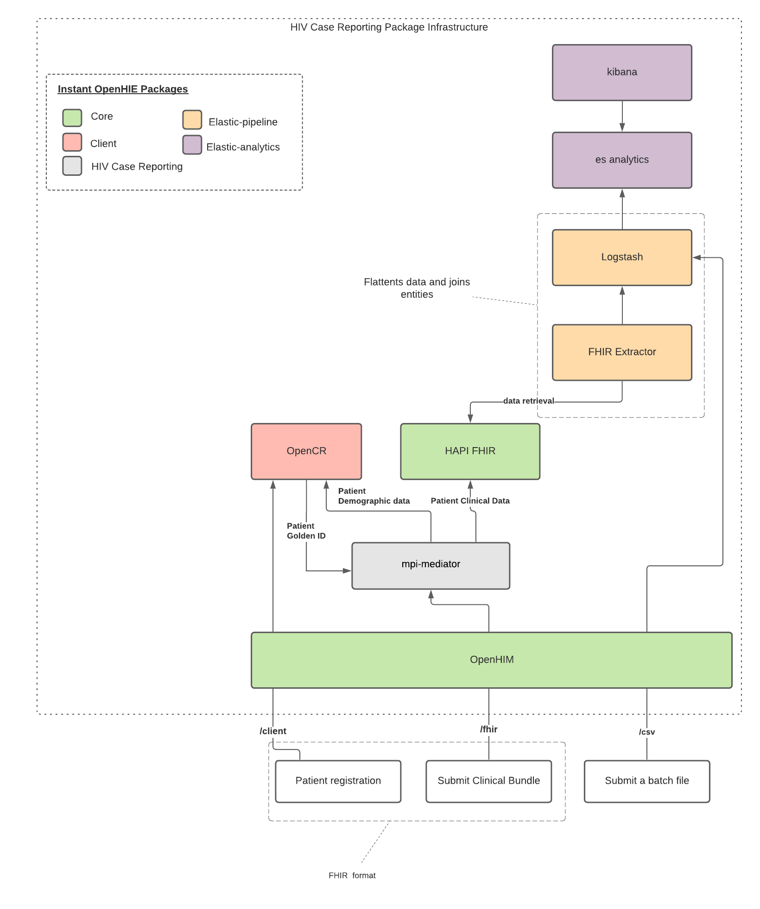

# hiv-case-reporting
An instantOHIE custom package for illustrating reporting of an hiv case using the instantOHIE data analytics package

To enable this package within the Instant OpenHIE, mount this project directory with your Instant OpenHIE start command. More details available on the [Instant OpenHIE docs site](https://openhie.github.io/instant/docs/how-to/creating-packages#how-to-execute-your-new-package)

## Components

- Elasticsearch <http://localhost:9201/> - (u: elastic p: dev_password_only) - for analytics
- Logstash (No UI) - for data pipeline config
- Kibana <http://localhost:5601/> - (u: elastic p: dev_password_only) - for live dashboards and data discovery
- HAPI FHIR <http://localhost:3447/> - for central storage of OLTP data
- OpenHIM <http://localhost:9000/> - (u: root@openhim.org p: instant101) - for transaction logging, routing and scheduled triggers
- OpenCR <http://localhost:3004/crux> - (u: root@intrahealth.org p: intrahealth) - for matching and linking patient records (MPI)

The diagram below illustrates the flow of hiv data in the system




## Starting Up

To mount the package into an Instant OpenHIE instance, clone the repository and run the following command in the instant repo root folder

### Docker

```sh
yarn docker:instant init core hiv-case-reporting --custom-package="<Path to package>"
```

### Kubernetes

```sh
yarn docker:instant init -t k8s core hiv-case-reporting --custom-package="<Path to package>"
```

**NB** The alias for the option `--custom-package` is `-c`

Once the package has been initialized, the following commands can be run to start, stop or destroy the instance.

### Docker

```sh
yarn docker:instant up -t docker core hiv-case-reporting
yarn docker:instant down -t docker core hiv-case-reporting
yarn docker:instant destroy -t docker core hiv-case-reporting
```

### Kubernetes

```sh
yarn docker:instant up -t docker core hiv-case-reporting
yarn docker:instant down -t docker core hiv-case-reporting
yarn docker:instant destroy -t docker core hiv-case-reporting
```
# Testing

To test, you can send an hiv case to <http://localhost:5001>. An example of an hiv case can be found [here](./test/CDR.postman_collection.json). This postman collection will add organization and location resources for the hiv case. The report can be accessed on the kibana hiv dashboard on <http://localhost:5601>. To send multiple case reports one can navigate to the test folder and run the following commands.

```sh
yarn
yarn bootstrap
yarn test:1000
```
